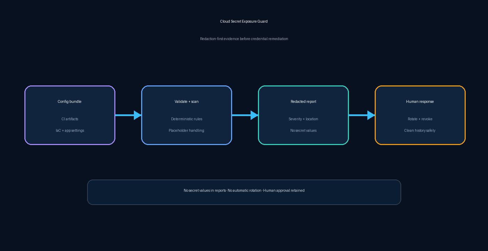

# Cloud Secret Exposure Guard

A deterministic, redaction-first DevSecOps gate that finds likely credentials in cloud configuration bundles without copying secret values into reports.



## The problem

Credentials can leak into `.env` files, CI artifacts, deployment configuration, and infrastructure repositories. A scanner that repeats the matched value into logs or tickets can make the exposure worse. Teams need a small, testable control that blocks unsafe configuration while returning only the evidence required for remediation.

Cloud Secret Exposure Guard checks file content for high-confidence key assignments and private-key headers. It ignores explicit placeholders, produces deterministic finding IDs, redacts evidence, and returns `PASS` or `BLOCK`. It never rotates a credential, deletes history, sends a message, or changes infrastructure.

## Architecture

1. A CI job or approved workflow supplies a configuration bundle.
2. Schema validation fails closed before scanning.
3. Deterministic rules identify risky assignments and private-key headers.
4. The report contains file, line, rule, severity, and remediation—but not the matched value.
5. A human decides how to revoke, rotate, and clean repository history.

## Run locally

Python 3.10+ is sufficient for the evaluator. Pillow is used only to regenerate the committed diagram.

```bash
PYTHONPATH=src python -m cloud_secret_exposure_guard examples/config-bundle.json
```

Run the tests:

```bash
PYTHONPATH=src python -m unittest discover -s tests -v
```

Use `--fail-on-findings` in a CI gate when exit code `2` should block a build.

## Safety properties

- Matched values never appear in the JSON report.
- Placeholder references such as `${SECRET}` are not treated as exposed values.
- Finding IDs are stable hashes of location and rule, not of the secret.
- The sample contains synthetic, nonfunctional values.
- The optional n8n workflow is inactive and contains no credential or mutation node.
- Credential rotation, repository-history cleanup, and production actions require human approval.

## Extending safely

Production teams should add provider-native scanning, entropy checks with reviewed allowlists, binary/archive handling, commit-history scanning, encrypted evidence storage, and protected remediation playbooks. Never persist raw matched values in logs, tickets, prompts, or analytics.

## What this demonstrates

- DevSecOps policy-as-code and secure failure modes
- Python automation, validation, redaction, and deterministic testing
- CI/CD quality gates and human-approval boundaries
- Cloud credential hygiene and safe AI/workflow orchestration

## License

MIT

